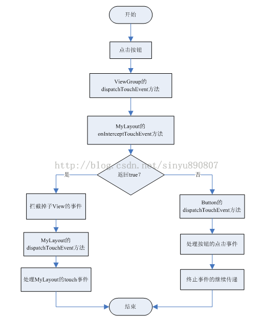

###Android 的事件分发机制

####1. View的事件分发

[原文链接](http://blog.csdn.net/guolin_blog/article/details/9097463)

总结View的事件分发, 是点击事件和触摸事件的分发:
View的触摸事件的onTouch()方法的返回值决定了,View的点击事件是否响应
- 若onTouch()的返回值为true, 那么点击事件将得不到响应;
- 若onTouch()的返回值为false,那么点击事件将会在触摸事件之后的到响应;

需要知道一点，只要你触摸到了任何一个控件，就一定会调用该控件的dispatchTouchEvent方法

```
public boolean dispatchTouchEvent(MotionEvent event) {  
    if (mOnTouchListener != null && (mViewFlags & ENABLED_MASK) == ENABLED &&  
            mOnTouchListener.onTouch(this, event)) {  
        return true;  
    }  
    return onTouchEvent(event);  
}
```

在dispatchTouchEvent()中的if语句的作用是,判断是否将调用onTouchEvent()方法,而View点击事件的onClick()方法是在onTouchEvent()中被调用的,也就是说,if语句中的判断结果决定了View的点击事件是否响应;

可以看到if语句的条件判断语句含有三个条件依次是: 
- 是否注册触摸事件;
- 是否可点击;
- 触摸响应onTouch()的返回值;

这三个条件缺一不可, 不然点击事件就得不到响应;

####2. ViewGroup的事件分发机制

[原文链接](http://blog.csdn.net/guolin_blog/article/details/9153747)

>什么是ViewGroup？它和普通的View有什么区别？

- 顾名思义，ViewGroup就是一组View的集合，它包含很多的子View和子VewGroup，是Android中所有布局的父类或间接父类，像LinearLayout、RelativeLayout等都是继承自ViewGroup的。但ViewGroup实际上也是一个View，只不过比起View，它多了可以包含子View和定义布局参数的功能。我们平时项目里经常用到的各种布局，全都属于ViewGroup的子类。

ViewGroup的事件分发是对于布局的触摸事件和布局之上的View的点击事件的事件分发;其中在布局文件中有一个重要的方法

```
    @Override  
    public boolean onInterceptTouchEvent(MotionEvent ev) {  
        return true;  
    }
```

事件分发流程图




1. Android事件分发是先传递到ViewGroup，再由ViewGroup传递到View的。
2. 在ViewGroup中可以通过onInterceptTouchEvent方法对事件传递进行拦截，onInterceptTouchEvent方法返回true代表不允许事件继续向子View传递，返回false代表不对事件进行拦截，默认返回false。
3. 子View中如果将传递的事件消费掉(肯定会消费掉,因为一个可点击的子View无论如何它的onDispatchTouchEvent()的返回值都为true)，ViewGroup中将无法接收到任何事件。

