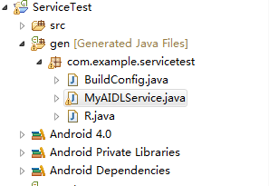
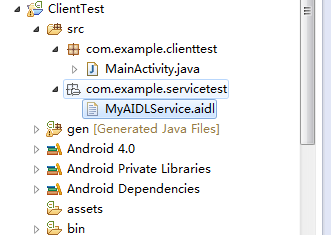

##我所知道的Service
[TOC]

文章推荐:
[学习 AIDL，这一篇文章就够了(上)](http://android.jobbole.com/84580/)
[学习 AIDL，这一篇文章就够了(下)](http://android.jobbole.com/84588/)

### 一. 如何使用服务
>1. 定义一个服务类, 
>2. 继承android.app.Service抽象类, 
>3. 重写onBind()方法,
>4. 在AndroidManifest.xml文件中注册服务;

###二. 服务中常用的方法
- onCreate():          服务创建时调用();
- onStartCommand():    服务启动时调用;
- onBind:    服务绑定时调用, 通过这个方法可以实现Activity与Service之间的通讯
- onUnBind:    服务解绑时调用
- onDestroy():         服务销毁时调用;

>`如果一个服务没有启动过或者已经被销毁,那么调用startService方法启动服务时会依次调用onCreate()和onStartCommand()方法,如果接下来继续调用startService()方法那么就只会调用onStartCommand()方法,onCreate()方法就不会被调用了;`

###三. 如何启动或停止启动服务
>服务有两种启动方式:绑定和不绑定, 所以有以下几种启动和停止的方式

1. 不绑定:
- 启动: startService(Intent name);
- 停止: stopService(Intent name);
2. 绑定:
- 启动: bindService(Intent name, ServiceConnection connection, int flag);
- 停止: unbindService(ServiceConnection connection);
3. 启动后绑定
- 启动: startService(Intent name);
- 绑定: bindService(Intent name, ServiceConnection connection, int flag);
- 解绑: unbindService(ServiceConnection connection);
- 停止: stopService(Intent name);
>注意: 服务启动后再绑定, 这种情况下需要先进行解绑才可停止服务

###四. 活动和服务进行通信
使用非绑定方式开启服务后,活动和服务之间就基本没有什么关系了;如果要实现活动和服务之间的通信需使用绑定方式开启服务

>1.调用bindService()绑定服务
>2.调用Service类中的onBind()方法返回自定义的IBinder对象
>3.在ServiceConnection匿名类的onServiceConnected()内获取onBind()方法返回的IBinder对象
>4.使用获取的IBinder对象调用自定义IBinder中的方法

Service代码:

```
public class TestService extends Service
{
    private final static String TAG = "TestService";

    @Nullable
    @Override
    public IBinder onBind(Intent intent)
    {
        Log.e(TAG, "onBind");
        return new MyBind();
    }

    public class MyBind extends Binder
    {
        public void doSomething()
        {
            Log.e(TAG, "doSomething");
        }
    }
}
```

Activity代码:

```
//重点提醒, 记得解绑
bindService(serviceIntent, mServiceConnection, Context.BIND_AUTO_CREATE);

private class TestServiceConnection implements ServiceConnection
{
    @Override
    public void onServiceConnected(ComponentName name, IBinder service)
    {
        TestService.MyBind mBinder = (TestService.MyBind) service;
        mBinder.doSomething();
    }

    @Override
    public void onServiceDisconnected(ComponentName name)
    {
        Log.e(TAG, "service disconnected");
    }
}
```

###五. 服务的生命周期


混合服务的生命周期:

```
E/TestService: onCreate
E/TestService: onStartCommand
E/TestService: onBind
E/TestService: onUnbind
E/TestService: onDestroy
```

关于服务的生命周期需要注意如下几个方面:
1. 如果一个Service被startService 方法多次启动，那么onCreate方法只会调用一次，onStart将会被调用多次（对应调用startService的次数），并且系统只会创建Service的一个实例（因此你应该知道只需要一次stopService调用就可以终止服务）。该Service将会一直在后台运行，而不管对应程序的Activity是否在运行，直到被调用stopService，或自身的stopSelf方法。当然如果系统资源不足，android系统也可能结束服务。
2. 被绑定的服务的生命周期：如果一个Service被某个Activity 调用 Context.bindService 方法绑定启动，不管调用 bindService 调用几次，onCreate方法都只会调用一次，同时onStart方法始终不会被调用。在与Service绑定的Activity销毁之前必须解绑, 不然会报错, 所以建议绑定服务使用全局的上下文变量.

###六.前台服务
1. 由于服务的优先级较低,当内存不足时,有可能会回收掉正在后台运行的服务.如果希望服务可以一直保持运行状态,那么就可以考虑使用前台服务;
2. 如果需要在系统状态栏显示数据,那么也可以使用前台服务;
3. 前台服务和普通服务最大的区别就在于，它会一直有一个正在运行的图标在系统的状态栏显示，下拉状态栏后可以看到更加详细的信息，非常类似于通知的效果

开启前台服务就是把以下代码写到Service类的onCreate()方法中(与创建通知的代码相同)

```
Notification notification = new Notification(R.drawable.ic_launcher, "Notification comes", System.currentTimeMillis());
Intent notificationIntent = new Intent(this, MyActivity.class);
PendingIntent pendingIntent = PendingIntent.getActivity(this, 0, notificationIntent, 0);
notification.setLatestEventInfo(this, "This is title", "This is content", pendingIntent);
startForeground(1, notification);
```

>注意:
>1. `使用startForeground,如果id为0,那么notification将不会显示`

###七.远程服务

####1. 标准远程服务
我们知道，Service其实是运行在主线程里的，如果直接在Service中处理一些耗时的逻辑，就会导致程序ANR。但是如果将MyService转换成一个远程Service就不会出现ANR异常了.这是为什么呢?
>这是由于，使用了远程Service后，MyService已经在另外一个进程当中运行了，所以只会阻塞该进程中的主线程，并不会影响到当前的应用程序。

- 虽然远程服务能避免阻塞主进程但是一般情况下如果可以不使用远程Service，就尽量不要使用它。
- 将一个普通的Service转换成远程Service其实非常简单，只需要在注册Service的时候将它的android:process属性指定成:remote就可以了
在AndroidManifest.xml文件中声明组件时使用如下语句可以将该组件运行在`包名:remote`进程中.
```
android:process=":remote"
```
具体设置如下:
```
<?xml version="1.0" encoding="utf-8"?>  
<manifest xmlns:android="http://schemas.android.com/apk/res/android"  
    package="com.example.servicetest"  
    android:versionCode="1"  
    android:versionName="1.0" >  
  
    ......  
      
    <service  
        android:name="com.example.servicetest.MyService"  
        android:process=":remote" >  
    </service>  
  
</manifest>  
```
>注意: `remote`不是关键字, 可使用其他单词替换

####2. AIDL
AIDL（Android Interface Definition Language）是Android接口定义语言的意思，它可以用于让某个Service与多个应用程序组件之间进行跨进程通信(IPC)，从而可以实现多个应用程序共享同一个Service的功能。

#####远程Service端

1. 首先需要新建一个AIDL文件，在这个文件中定义好Activity需要与Service进行通信的方法。

```
package com.example.servicetest;  
interface MyAIDLService {  
    int plus(int a, int b);  
    String toUpperCase(String str);  
}  
```
点击保存之后，会在gen文件夹下自动生成一个对应的Java文件


2. 然后修改自己的Service类中的代码，在里面实现我们刚刚定义好的MyAIDLService接口

```
public class MyService extends Service {  
  
    ......  
  
    @Override  
    public IBinder onBind(Intent intent) {  
        return mBinder;  
    }  
    MyAIDLService.Stub mBinder = new Stub() {  
  
        @Override  
        public String toUpperCase(String str) throws RemoteException {  
            if (str != null) {  
                return str.toUpperCase();  
            }  
            return null;  
        }  
    };  
}  
```
>这里为什么可以这样写呢？因为Stub其实就是Binder的子类，所以在onBind()方法中可以直接返回Stub的实现。

3. 接下来修改MainActivity中的代码

```
public class MainActivity extends Activity implements OnClickListener {  
  
    private Button startService;  
  
    private Button stopService;  
  
    private Button bindService;  
  
    private Button unbindService;  
      
    private MyAIDLService myAIDLService;  
  
    private ServiceConnection connection = new ServiceConnection() {  
  
        @Override  
        public void onServiceDisconnected(ComponentName name) {  
        }  
  
        @Override  
        public void onServiceConnected(ComponentName name, IBinder service) {  
            myAIDLService = MyAIDLService.Stub.asInterface(service);  
            try {  
                int result = myAIDLService.plus(3, 5);  
                String upperStr = myAIDLService.toUpperCase("hello world");  
                Log.d("TAG", "result is " + result);  
                Log.d("TAG", "upperStr is " + upperStr);  
            } catch (RemoteException e) {  
                e.printStackTrace();  
            }  
        }  
    };  
  
    ......  
  
}  
```
>我们只是修改了ServiceConnection中的代码。可以看到，这里首先使用了MyAIDLService.Stub.asInterface()方法将传入的IBinder对象传换成了MyAIDLService对象，接下来就可以调用在MyAIDLService.aidl文件中定义的所有接口了。

4. 在另一个应用程序中去绑定Service时就只能使用到隐式Intent,因为你并不知道类名.所以需呀修改AndroidManifest.xml中的代码，给MyService加上一个action，如下所示：

```
<?xml version="1.0" encoding="utf-8"?>  
<manifest xmlns:android="http://schemas.android.com/apk/res/android"  
    package="com.example.servicetest"  
    android:versionCode="1"  
    android:versionName="1.0" >  
  
    ......  
  
    <service  
        android:name="com.example.servicetest.MyService"  
        android:process=":remote" >  
        <intent-filter>  
            <action android:name="com.example.servicetest.MyAIDLService"/>  
        </intent-filter>  
    </service>  
  
</manifest>  
```
>这就说明，MyService可以响应带有com.example.servicetest.MyAIDLService这个action的Intent。

#####本地端

1. 首先需要将aidl文件从远程Service1端项目中拷贝过来，注意要将原有的包路径一起拷贝过来，完成后项目的结构如下图所示：



2. 新建一个新的Activity在其中加入和MyService建立关联的代码

```
public class MainActivity extends Activity {  
  
    private MyAIDLService myAIDLService;  
  
    private ServiceConnection connection = new ServiceConnection() {  
  
        @Override  
        public void onServiceDisconnected(ComponentName name) {  
        }  
  
        @Override  
        public void onServiceConnected(ComponentName name, IBinder service) {  
            myAIDLService = MyAIDLService.Stub.asInterface(service);  
            try {  
                int result = myAIDLService.plus(50, 50);  
                String upperStr = myAIDLService.toUpperCase("comes from ClientTest");  
                Log.d("TAG", "result is " + result);  
                Log.d("TAG", "upperStr is " + upperStr);  
            } catch (RemoteException e) {  
                e.printStackTrace();  
            }  
        }  
    };  
  
    @Override  
    protected void onCreate(Bundle savedInstanceState) {  
        super.onCreate(savedInstanceState);  
        setContentView(R.layout.activity_main);  
        Button bindService = (Button) findViewById(R.id.bind_service);  
        bindService.setOnClickListener(new OnClickListener() {  
            @Override  
            public void onClick(View v) {  
                Intent intent = new Intent("com.example.servicetest.MyAIDLService");  
                bindService(intent, connection, BIND_AUTO_CREATE);  
            }  
        });  
    }  
}  
```

>`不过还有一点需要说明的是，由于这是在不同的进程之间传递数据，Android对这类数据的格式支持是非常有限的，基本上只能传递Java的基本数据类型、字符串、List或Map等。那么如果我想传递一个自定义的类该怎么办呢？这就必须要让这个类去实现Parcelable接口，并且要给这个类也定义一个同名的AIDL文件。这部分内容并不复杂，而且和Service关系不大，所以就不再详细进行讲解了，感兴趣的朋友可以自己去查阅一下相关的资料。`

###八.异步服务 --- IntentService
>1. 服务中的代码都是默认运行在主线程当中的，如果直接在服务里去处理一些耗时的逻辑，就很容易出现 ANR（ Application NotResponding）的情况。
>2. Android 专门提供了一个IntentService 类,可以简单地创建一个异步的、会自动停止的服务;
    
1. 自定义MyIntentService继承IntentService抽象类,在构造器中调用super语句,重写onHandleIntent();
2. 在onHandleIntent()方法中处理逻辑, 逻辑处理完成后会自动调用onDestory()方法;
3. 调用startService(Intent name)方法开启服务.

###九.后台执行的定时任务
>android一般实现定时任务有两种方式:
>1. JAVA API中提供的Timer类; 
>2. android提供的Alarm机制;由于Timer没有CPU唤醒功能所以那些需要长期在后台运行的定时任务只能使用Alarm机制来完成了.
    
1.获取AlarmManager;

```
AlarmManager manager = (AlarmManager) getSystemService(Context.ALARM_SERVICE);
```

2.AlarmManager调用set()方法设置定时任务

```
int anHour = 60 * 60 * 1000; // 这是一小时的毫秒数
long triggerAtTime = SystemClock.elapsedRealtime() + anHour;
Intent i = new Intent(this, AlarmReceiver.class);
PendingIntent pi = PendingIntent.getBroadcast(this, 0, i, 0);
manager.set(AlarmManager.ELAPSED_REALTIME_WAKEUP, triggerAtTime, pi);
```

###十.Service和Thread区别
>很多时候，你可能会问，为什么要用 Service，而不用 Thread 呢，因为用 Thread 是很方便的，比起 Service 也方便多了，下面我详细的来解释一下。

- Thread：Thread 是程序执行的最小单元，它是分配CPU的基本单位。可以用 Thread 来执行一些异步的操作。
- Service：Service 是android的一种机制，当它运行的时候如果是Local Service，那么对应的 Service 是运行在主进程的 main 线程上的。如：onCreate，onStart 这些函数在被系统调用的时候都是在主进程的 main 线程上运行的。如果是Remote Service，那么对应的 Service 则是运行在独立进程的 main 线程上。因此请不要把 Service 理解成线程，它跟线程半毛钱的关系都没有！

>既然这样，那么我们为什么要用 Service 呢？

- 其实这跟 android 的系统机制有关。

- 我们先拿 Thread 来说，Thread 的运行是独立于 Activity 的，也就是说当一个 Activity 被 finish 之后，如果你没有主动停止 Thread 或者 Thread 里的 run 方法没有执行完毕的话，Thread 也会一直执行。因此这里会出现一个问题：当 Activity 被 finish 之后，你不再持有该 Thread 的引用。另一方面，你没有办法在不同的 Activity 中对同一 Thread 进行控制。举个例子：如果你的 Thread 需要不停地隔一段时间就要连接服务器做某种同步的话，该 Thread 需要在 Activity 没有start的时候也在运行。这个时候当你 start 一个 Activity 就没有办法在该 Activity 里面控制之前创建的 Thread。

- 因此你便需要创建并启动一个 Service ，在 Service 里面创建、运行并控制该 Thread，这样便解决了该问题（因为任何 Activity 都可以控制同一 Service，而系统也只会创建一个对应 Service 的实例）。
- 因此你可以把Service想象成一种消息服务,而你可以在任何有Context的地方调用
- Context.startService、Context.stopService、Context.bindService、Context.unbindService来控制它,你也可以在Service里注册 BroadcastReceiver, 在其他地方通过发送 broadcast 来控制它, 当然这些都是Thread做不到的.

注意:
`1. 在service的生命周期中onCreate()方法只会被调用一次,而onStartCommand()方法的调用调用次数和startService()方法的调用次数一样;`
`2. 注意虽然每调用一次 startService()方法， onStartCommand()就会执行一次，但实际上每个服务都只会存在一个实例。所以不管你调用了多少次 startService()方法，只需调用一次 stopService()或 stopSelf()方法，服务就会停止下来了。`
`3. 如果对一个服务既调用了 startService()方法，又调用了 bindService()方法的，这种情况下根据 Android 系统的机制，一个服务只要被启动或者被绑定了之后，就会一直处于运行状态，必须要让以上两种条件同时不满足，服务才能被销毁。所以，这种情况下要同时调用 stopService()和 unbindService()方法， onDestroy()方法才会执行。`

###十一.Service属性

####1. android:exported
[转自: Service属性介绍: android:exported](http://blog.csdn.net/zhouchangshi/article/details/23774563)
>这个属性用于指示该服务是否能够被其他应用程序组件调用或跟它交互。如果设置为true，则能够被调用或交互，否则不能。设置为false时，只有同一个应用程序的组件或带有相同用户ID的应用程序才能启动或绑定该服务。

它的默认值依赖与该服务所包含的过滤器。没有过滤器则意味着该服务只能通过指定明确的类名来调用，这样就是说该服务只能在应用程序的内部使用（因为其他外部使用者不会知道该服务的类名），因此这种情况下，这个属性的默认值是false。另一方面，如果至少包含了一个过滤器，则意味着该服务可以给外部的其他应用提供服务，因此默认值是true。
这个属性不是限制把服务暴露给其他应用程序的唯一方法。还可以使用权限来限制能够跟该服务交互的外部实体。

详细一点: 
1. 这样的Service其他进程是不能访问的

```
<service Android:name=".RemoteService"/>
```

2. 设置访问权限

```
<service android:name=".RemoteService"
         android:exported="true" 
         android:permission="com.stone.RemoteAccess">
         <intent-filter>
	         <action android:name="com.example.ipc_b.RemoteService"/>
         </intent-filter>
</service>
```

其他进程要访问上面的service, 必须使用permission

```
<uses-permission android:name="com.stone.RemoteAccess"/>
```

3. 其他进程可以访问下面的service, 有intent-filter(包含action), exported属性就默认为true

```
<service android:name=".RemoteService">
	<intent-filter>
	    <action android:name="com.example.ipc_b.RemoteService"/>
    </intent-filter>
</service>
```
    


