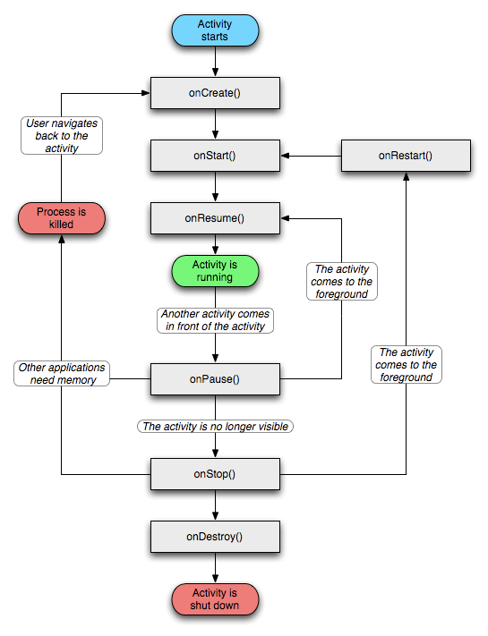

###我所见到的Activity
>这里是我在开发过程中所遇见的有关于Activity的一些知识分享

[toc]


####1. Activity的生命周期图示



####1.1 Activity生命周期中的四种状态
1. 在屏幕的前台（Activity活动栈栈顶），叫做活动状态或者运行状态（active or running）

2. 如果一个Activity失去焦点，但是依然可见（一个新的非全屏的Activity 或者一个透明的Activity 被放置在栈顶），叫做暂停状态（Paused）。一个暂停状态的Activity依然保持活力（保持所有的状态，成员信息，和窗口管理器保持连接），但是在系统内存极端低下的时候将被杀掉。

3. 如果一个Activity被另外的Activity完全覆盖掉，叫做停止状态（Stopped）。它依然保持所有状态和成员信息，但是它不再可见，所以它的窗口被隐藏，当系统内存需要被用在其他地方的时候，Stopped的Activity将被杀掉。

4. 如果一个Activity是Paused或者Stopped状态，系统可以将该Activity从内存中删除，Android系统采用两种方式进行删除，要么要求该Activity结束，要么直接杀掉它的进程。当该Activity再次显示给用户时，它必须重新开始和重置前面的状态。

#####1.2Activity切换时的方法调用顺序
Activity1 ----- startActivity()------> Activity2 ----- startActivity() ------->Activity1

```
onCreate::main
onStart::main
onResume::main

onPause::main
onCreate::other
onStart::other
onResume::other
onStop::main

onPause::other
onCreate::main
onStart::main
onResume::main
onStop::other
```

Activity1 ----- startActivity()------> Activity2 ----- back ------->Activity1

```
onCreate::main
onStart::main
onResume::main

onPause::main
onCreate::other
onStart::other
onResume::other
onStop::main

onPause::other
onRestart::main
onStart::main
onResume::main
onStop::other
onDestroy::other
```

####2. Activity的启动模式
>在Android中每个界面都是一个Activity，切换界面操作其实是多个不同Activity之间的实例化操作。在Android中Activity的启动模式决定了Activity的启动运行方式。

Activity启动模式设置：
```
<activity android:name=".MainActivity" android:launchMode="standard" />
```
#####2.1 Activity的四种启动模式及使用场景

1. standard
 默认启动模式，每次激活Activity时都会创建Activity实例，并放入任务栈中。

2. singleTop
 如果在任务的栈顶正好存在该Activity的实例， 就重用该实例，否者就会创建新的实例并放入栈顶(即使栈中已经存在该Activity实例，只要不在栈顶，都会创建实例)。
 >singleTop适合接收通知启动的内容显示页面。例如，某个新闻客户端的新闻内容页面，如果收到10个新闻推送，每次都打开一个新闻内容页面是很烦人的。

3. singleTask
如果已经存在一个task与新activity亲和度（taskAffinity）一样，则activity将启动到该task。如果不是，就启动一个新task。同一个application里面，每个activity的taskAffinity默认都是一样的。
 如果在栈中已经有该Activity的实例，就重用该实例(会调用实例的onNewIntent())。重用时，会移除它上面的所有实例, 让该实例回到栈顶。如果栈中不存在该实例，将会创建新的实例放入栈顶。 
>singleTask适合作为程序入口点。例如浏览器的主界面。不管从多少个应用启动浏览器，只会启动主界面一次，其余情况都会走onNewIntent，并且会清空主界面上面的其他页面。

4. singleInstance
 在一个新栈中创建该Activity实例，并让多个应用共享改栈中的该Activity实例。一旦改模式的Activity的实例存在于某个栈中，任何应用再激活改Activity时都会重用该栈中的实例，其效果相当于多个应用程序共享一个应用，不管谁激活该Activity都会进入同一个应用中。
 >singleInstance适合需要与程序分离开的页面。例如闹铃提醒，将闹铃提醒与闹铃设置分离。singleInstance不要用于中间页面，如果用于中间页面，跳转会有问题，比如：A -> B (singleInstance) -> C，完全退出后，再次启动，首先打开的是B。

#####2.2 关于onNewIntent()方法
"This is called for activities that set launchMode to "singleTop" in their package, or if a client used the FLAG_ACTIVITY_SINGLE_TOP flag when calling startActivity(Intent). In either case, when the activity is re-launched while at the top of the activity stack instead of a new instance of the activity being started, onNewIntent() will be called on the existing instance with the Intent that was used to re-launch it."

对于在其程序包中将launchMode设置为“singleTop”的活动，或者如果客户端在调用startActivity（Intent）时使用FLAG_ACTIVITY_SINGLE_TOP标志，则调用此操作。在这两种情况下，当在活动堆栈顶部重新启动的活动不是新的实例时，将在现有实例上调用onNewIntent（）使用用于重新启动Activity的Intent。

当调用到onNewIntent(intent)的时候，需要在onNewIntent() 中使用setIntent(intent)赋值给Activity的Intent.否则，后续的getIntent()都是得到老的Intent。而且系统可能会随时杀掉后台运行的Activity，如果这一切发生，那么系统就会调用onCreate方法，而不调用onNewIntent方法，一个好的解决方法就是在onCreate和onNewIntent方法中调用同一个处理数据的方法.
or
```
public void onCreate(Bundle savedInstanceState) {

   super.onCreate(savedInstanceState);

   setContentView(R.layout.main);

   processExtraData();

 }

 protected void onNewIntent(Intent intent) {

   super.onNewIntent(intent);

   setIntent(intent);//must store the new intent unless getIntent() will return the old one

   processExtraData()

 }

 private void processExtraData(){

   Intent intent = getIntent();

   //use the data received here

 }
```

####3. 关于onActivityResult不执行问题
在startActivityForResult()使用时，若要onActivityResult()方法能正常工作那么必须将被启动Activity的启动模式设置为`standard`或者`singleTop` .
>注意: 经测试, 这个bug以及被修复了, 但是还不清楚具体情况

####4. 使用intent传递对象
Android中Intent传递类对象提供了两种方式
- 实现Serializable接口传递对象
- 实现Parcelable接口传递对象。

Intent中传递这2种对象的方法：
```
Bundle.putSerializable(Key,Object);  //实现Serializable接口的对象

Bundle.putParcelable(Key, Object); //实现Parcelable接口的对象
```

####5. screenOrientation属性
#####5.1 screenOrientation属性介绍
- "unspecified":默认值 由系统来判断显示方向.判定的策略是和设备相关的，所以不同的设备会有不同的显示方向. 
- "landscape":横屏显示（宽比高要长） 
- "portrait":竖屏显示(高比宽要长) 
- "user":用户当前首选的方向 
- "behind":和该Activity下面的那个Activity的方向一致(在Activity活动栈中的) 
- "sensor":有物理的感应器来决定。如果用户旋转设备这屏幕会横竖屏切换。 
- "nosensor":忽略物理感应器，这样就不会随着用户旋转设备而更改了（"unspecified"设置除外）。

#####5.2 属性设置
1. 配置文件中
```
android:screenOrientation="portrait",  为竖屏显示。
android:screenOrientation="landscape"，为横屏显示。
```
2. 代码中

```
setRequestedOrientation(ActivityInfo.SCREEN_ORIENTATION_LANDSCAPE)
```

#####5.3 横竖屏对应不同的布局文件
如果要让软件在横竖屏之间切换，由于横竖屏的高宽会发生转换，有可能会要求不同的布局。可以通过以下方法来切换布局：

1. 在res目录下建立layout-land和layout-port目录,相应的layout文件不变，比如main.xml。layout-land是横屏的layout,layout-port是竖屏的layout，其他的不用管，模拟器会自动寻找。
2. 通过 this.getResources().getConfiguration().orientation来判断当前是横屏还是竖屏然后来加载相应的 xml布局文件。因为当屏幕变为横屏的时候,系统会重新呼叫当前Activity的onCreate方法,你可以把以下方法放在你的onCreate中来检查当前的方向,然后可以让你的setContentView来载入不同的layout xml.

####6. configChanges属性
>当你的Activity正显示在屏幕上时, 如果这时候手机的一些配置(比如: 横竖屏切换, 键盘的可用性等)发生了改变, 那么系统就会调用`onConfigurationChanged`方法. 注意, 只有当你在配置文件中选定`configChanges`属性时才会被调用, 不然就会通过正常的生命周期重启Activity.

#####6.1 configChanges属性对Activity生命周期的影响
1. 未设置configChanges

切换成横屏时的方法调用
```
onPause-->
onSaveInstanceState-->
onStop-->
onCreate-->
onStart-->
onRestoreInstanceState-->
onResume-->
```
切换成竖屏时的方法调用
```
onResume-->
onSaveInstanceState-->
onPause-->
onStop-->
onCreate-->
onStart-->
onRestoreInstanceState-->
onResume-->
```
2. Activity添加 android:configChanges="orientation|screenSize"
>为啥orientation, screenSize俩值为啥必须合用这个目前还搞不懂

切换成横屏时的方法调用
```
onConfigurationChanged-->
```
切换成竖屏时的方法调用
```
onConfigurationChanged-->
```

#####6.2 configChanges属性介绍
- "mcc" ：国际移动用户识别码所属国家代号改变了-----  sim被侦测到了，去更新mcc，mcc是移动用户所属国家代号 
- "mnc"： 国际移动用户识别码的移动网号码改变了------ sim被侦测到了，去更新mnc，MNC是移动网号码，最多由两位数字组成，用于识别移动用户所归属的移动通信网 
- "locale"： 地址改变了-----用户选择了一个新的语言会显示出来 
- "touchscreen"： 触摸屏是改变了------通常是不会发生的 
- "keyboard" ：键盘发生了改变----例如用户用了外部的键盘 
- "keyboardHidden"： 键盘的可用性发生了改变 
- "navigation"： 导航发生了变化-----通常也不会发生 
- "screenLayout"： 屏幕的显示发生了变化------不同的显示被激活 
- "fontScale"： 字体比例发生了变化----选择了不同的全局字体 
- "uiMode"： 用户的模式发生了变化 
- "orientation"： 屏幕方向改变了 
- "screenSize"： 屏幕大小改变了 
- "smallestScreenSize"： 屏幕的物理大小改变了，如：连接到一个外部的屏幕上

####扩展
#####1. Android下Context、Activity、Application之间有什么区别
  首先Activity和Application都是Context的子类。Context从字面上理解就是上下文的意思，在实际应用中它也确实是起到了管理上下文环境中各个参数和变量的总用，方便我们可以简单的访问到各种资源。虽然Activity和Application都是Context的子类，但是他们维护的生命周期不一样。前者维护一个Acitivity的生命周期，所以其对应的Context也只能访问该activity内的各种资源。后者则是维护一个Application的证明周期。
  
 >还有就是，在使用context的时候，小心内存泄露，防止内存泄露，注意一下几个方面：

1. 不要让生命周期长的对象引用activity context，即保证引用activity的对象要与activity本身生命周期是一样的

2. 对于生命周期长的对象，可以使用application context

3. 避免非静态的内部类，尽量使用静态类，避免生命周期问题，注意内部类对外部对象引用导致的生命周期变化

####参考链接
[Android中Activity四种启动模式和taskAffinity属性详解](http://blog.csdn.net/zhangjg_blog/article/details/10923643)