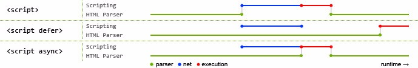

##Script 属性 async 和 defer 

@(JavaScript)

###参考
[浅谈script标签的defer和async](https://segmentfault.com/a/1190000006778717)

###defer
这个属性的用途是表明脚本在执行时不会影响页面的构造。也就是说，脚本会被延迟到整个页面都解析完毕后再运行。因此，在`<script>`元素中设置defer属性，相当于告诉浏览器立即下载，但延迟执行。
HTML5规范要求脚本按照它们出现的先后顺序执行，因此第一个延迟脚本会先于第二个延迟脚本执行，而这两个脚本会先于DOMContentLoaded事件执行。在现实当中，延迟脚本并不一定会按照顺序执行，也不一定会在DOMContentLoad时间触发前执行，因此最好只包含一个延迟脚本。

###async
这个属性与defer类似，都用于改变处理脚本的行为。同样与defer类似，async只适用于外部脚本文件，并告诉浏览器立即下载文件。但与defer不同的是，标记为async的脚本并不保证按照它们的先后顺序执行。

第二个脚本文件可能会在第一个脚本文件之前执行。因此确保两者之间互不依赖非常重要。指定async属性的目的是不让页面等待两个脚本下载和执行，从而异步加载页面其他内容。

###相同点和不同点

####相同点

- 异步加载文件
- 只对外部脚本文件有效
- 都不能保证执行顺序

####不同点

- `async` 文件加载完之后会立即执行
- `defer` 文件加载完之后会延迟执行

###结论
最稳妥的办法还是把`<script>`写在`<body>`底部，没有兼容性问题，没有白屏问题，没有执行顺序问题，高枕无忧，不要搞什么defer和async的花啦~