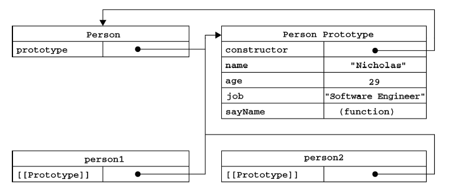
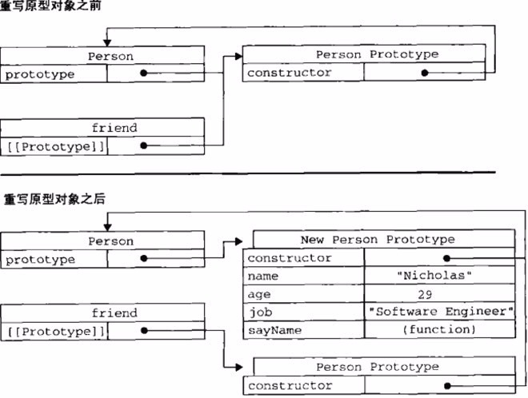

##原型对象

@(JavaScript)

无论什么时候，只要创建了一个新函数，就会为该函数创建一个`prototype`属性，这个属性指向函数的原型对象。而所有原型对象都会获得一个`constructor`属性，这个属性是一个指向`prototype`属性所在函数的指针。

函数、`prototype`、`constructor`jian



```
function Person() {
}

Person.prototype.name = "Nicholas";
Person.prototype.age = 29;
Person.prototype.job = "Software Engineer";
Person.prototype.sayName = function () {
  alert(this.name);
}

var person1 = new Person();
person1.sayName(); //"Nicholas"

var person2 = new Person();
person2.sayName(); //"Nicholas"

alert(person1.sayName == person2.sayName); //true
```

>注意：当为对象实例添加一个属性时，这个属性就会屏蔽原型对象中保存的同名属性。

###constructor属性
>`constructor`属性是`prototype`属性自动获得的，它指向`prototype`属性所在函数。原型对象被重写之后`constructor`属性需要手动为其赋值构造函数名。

###原型的动态性
>我们对原型对象所做的任何修改都能够立即从实例上反映出来---即使是先创建了实例后修改原型也照样如此

```
var friend = new Person();

person.prototype.sayHi = function(){
  alert("Hi");
}

friend.sayHi();
```

尽管原型具有动态性但是如果是重写整个原型对象，那么情况就不一样了。记住，`实例中的指针仅指向原型，而不指向构造函数`。

```
function Person() {
}

var friend = new Person();
person.prototype = {
  constructor : Person,
  name : "Nicholas",
  age : 29,
  job : "Software Engineer",
  sayName : function () {
    alert(this.name);
  }
}；

friend.sayName(); //error
```



>重写原型对象切断了现有原型与任何之前已经存在的对象实例（之后创建的对象实例不在此列）间的联系；它们引用的仍然是最初的原型。

####方法简介

>isPrototypeOf()：判断某实例对象的原型属性是否指向某函数。

```
alert(Person.prototype.isPrototypeOf(person1));
```

>getPrototypeOf()：获取对象的原型

```
alert(Object.getPrototypeOf(person1) == Person.prototype);
```

>hasOwnProperty()：检测属性是存在于实例中还是原型中。

```
alert(person1.hasOwnProperty("name"));
```

>in操作符：判断对象是否能够访问给定属性。

```
alert("name" in person1);
```

>getOwnPropertyNames()：获取所有实例属性。

```
ver keys = Object.getOwnPropertyNames(person.property);
alert(keys);
```

###扩展

####通过`in`操作符和`hasOwnProperty()`确定属性存在对象中还是原型中。

```
function hasPrototypeProperty(object, name){
	return !object.hasOwnProperty(name) && (name in object)
}
```